# Code IT MVP

**"Track Your Coding Progress. Unified."**

## Overview

Code IT MVP is a minimal viable product of a centralized web platform for KIET IT students to track and compare their competitive programming progress. It consolidates data from Codeforces and LeetCode into a simple, unified leaderboard and personal dashboard.

## Problem Statement

KIET IT students have their coding progress scattered across multiple platforms (Codeforces, LeetCode) with no unified way to measure or compare their skills within their peer group. This leads to lack of visibility and motivation.

## Solution

A lightweight web application that serves as a simple hub for viewing:
- A unified leaderboard based on a combined score
- Personal dashboard with profile data
- Upcoming contests calendar
- Shareable public profiles

## Key Features (MVP)

- **User Authentication**: Simple email/password signup and login
- **Profile Linking**: Link Codeforces and LeetCode usernames
- **Unified Leaderboard**: Ranked by combined scoring formula
- **Personal Dashboard**: View your stats and rank
- **Public Profiles**: Shareable profile cards
- **Contest Calendar**: View upcoming contests from multiple platforms
- **Basic Filtering**: Filter leaderboard by graduation year and branch

## Architecture Overview


## User Journey (MVP)


## Request Flow (MVP)


## Frontend Component Flow


## Frontend State Management


## Frontend Page Components (MVP)

```mermaid
graph TB
    A["🏠 Dashboard Page"] --> A1["Profile Card<br/>Name, Year, Branch"]
    A --> A2["Stats Overview<br/>CF Rating, LC Rating"]
    A --> A3["Rank Card<br/>Current Rank"]
    A --> A4["Manual Sync Button"]
    A --> A5["Growth Chart<br/>Last 30 days"]
    
    B["📊 Leaderboard Page"] --> B1["Filter Section<br/>Year & Branch"]
    B --> B2["User Table<br/>Rank | Name | CF | LC | Score"]
    B --> B3["Pagination<br/>50 per page"]
    B --> B4["Name → Link to Profile"]
    
    C["🎯 Contests Page"] --> C1["Filter by Platform<br/>CF / LC / Both"]
    C --> C2["Contest List<br/>Name | Date | Platform"]
    C --> C3["Registration Link<br/>Opens Platform"]
    
    D["👤 Profile Page"] --> D1["User Card<br/>Avatar | Stats"]
    D --> D2["Detailed Stats<br/>Problems Solved, etc"]
    D --> D3["Share Options<br/>Copy Link / QR"]
    D --> D4["Edit Profile<br/>If Own Profile"]
```



## Tech Stack

**Frontend**
- Next.js 14 (App Router)
- React 18
- TypeScript
- Tailwind CSS
- Recharts (simple charts)

**Backend**
- Next.js API Routes (serverless)
- Manual data sync on user request

**Database & Auth**
- Supabase PostgreSQL
- Supabase Authentication

**Deployment**
- Vercel (frontend + serverless functions)
- Supabase (database + auth)

## Scoring System

```
Code IT Score = (CF_Score × 0.6) + (LC_Score × 0.4)

Where:
- CF_Score = Codeforces Rating / 10
- LC_Score = LeetCode Rating
```

**Example**: 
- Codeforces: 1500 rating → 150 points × 0.6 = 90
- LeetCode: 1800 rating → 1800 × 0.4 = 720
- **Total: 810 points**

## Project Structure

```
code-it-mvp/
├── src/
│   ├── app/
│   │   ├── (auth)/
│   │   │   ├── login/
│   │   │   └── register/
│   │   ├── (main)/
│   │   │   ├── dashboard/
│   │   │   ├── leaderboard/
│   │   │   ├── contests/
│   │   │   └── profile/[id]/
│   │   ├── api/
│   │   │   ├── auth/
│   │   │   ├── users/
│   │   │   ├── leaderboard/
│   │   │   └── sync/
│   │   └── layout.tsx
│   ├── components/
│   │   ├── ui/
│   │   ├── leaderboard/
│   │   ├── dashboard/
│   │   └── navigation/
│   ├── lib/
│   │   ├── supabase.ts
│   │   ├── api-clients/
│   │   │   ├── codeforces.ts
│   │   │   └── leetcode.ts
│   │   ├── scoring.ts
│   │   └── utils.ts
│   └── types/
│       └── database.ts
├── supabase/
│   └── migrations/
└── package.json
```

## Getting Started

### Prerequisites

- Node.js 18+
- npm/yarn/pnpm
- Supabase account
- GitHub account (for Vercel)

### Installation

1. **Clone the repository**
```bash
git clone https://github.com/yourusername/code-it-mvp.git
cd code-it-mvp
```

2. **Install dependencies**
```bash
npm install
```

3. **Set up environment variables**
```bash
cp .env.example .env.local
```

4. **Configure `.env.local`**
```env
# Supabase
NEXT_PUBLIC_SUPABASE_URL=https://your-project.supabase.co
NEXT_PUBLIC_SUPABASE_ANON_KEY=your-anon-key
SUPABASE_SERVICE_ROLE_KEY=your-service-role-key

# Codeforces & LeetCode (optional, for API calls)
CODEFORCES_API_BASE=https://codeforces.com/api
LEETCODE_GRAPHQL_URL=https://leetcode.com/graphql

# Sync Secret
SYNC_SECRET=your-secure-random-string
```

5. **Set up database**
```bash
npx supabase db push
```

6. **Run development server**
```bash
npm run dev
```

7. **Open browser**
```
http://localhost:3000
```

## Database Schema (MVP)

### Users Table
```sql
CREATE TABLE users (
  id UUID PRIMARY KEY DEFAULT gen_random_uuid(),
  email TEXT UNIQUE NOT NULL,
  username TEXT NOT NULL,
  created_at TIMESTAMP DEFAULT now(),
  codeforces_username TEXT,
  leetcode_username TEXT,
  year INTEGER,
  branch TEXT,
  is_public BOOLEAN DEFAULT true
);
```

### User Stats Table
```sql
CREATE TABLE user_stats (
  id UUID PRIMARY KEY DEFAULT gen_random_uuid(),
  user_id UUID REFERENCES users(id) ON DELETE CASCADE,
  cf_rating INTEGER DEFAULT 0,
  cf_problems_solved INTEGER DEFAULT 0,
  lc_rating INTEGER DEFAULT 0,
  lc_problems_solved INTEGER DEFAULT 0,
  combined_score INTEGER DEFAULT 0,
  last_updated TIMESTAMP DEFAULT now(),
  UNIQUE(user_id)
);
```

### Contests Table
```sql
CREATE TABLE contests (
  id UUID PRIMARY KEY DEFAULT gen_random_uuid(),
  name TEXT NOT NULL,
  platform TEXT NOT NULL,
  start_time TIMESTAMP NOT NULL,
  duration_minutes INTEGER,
  contest_id TEXT,
  url TEXT
);
```

## API Endpoints (MVP)

### Authentication
- `POST /api/auth/register` - Create account
- `POST /api/auth/login` - Login
- `POST /api/auth/logout` - Logout
- `GET /api/auth/me` - Get current user

### Users
- `GET /api/users/profile` - Get your profile
- `PUT /api/users/profile` - Update profile
- `POST /api/users/link-platforms` - Link coding accounts
- `GET /api/users/:id` - Get public profile

### Leaderboard
- `GET /api/leaderboard` - Get leaderboard
  - Query params: `?year=2024&branch=IT&page=1&limit=50`

### Stats & Sync
- `GET /api/users/:id/stats` - Get user stats
- `POST /api/sync/:userId` - Manual sync (authenticated users only)

### Contests
- `GET /api/contests` - Get upcoming contests

## Development Workflow

### Code Quality
```bash
# Typecheck
npm run type-check

# Lint
npm run lint

# Format
npm run format
```

### Database
```bash
# Create migration
npx supabase migration new add_feature

# Apply migrations
npx supabase db push

# Reset (local only)
npx supabase db reset
```

### Manual Data Sync

Users can manually sync their stats from their dashboard. The app will:

1. Fetch Codeforces rating from public API
2. Fetch LeetCode rating via GraphQL
3. Calculate combined score
4. Update database
5. Recalculate leaderboard rankings

```typescript
// Example sync function
async function syncUserStats(userId: string, cfUsername: string, lcUsername: string) {
  const cfStats = await fetchCodeforces(cfUsername);
  const lcStats = await fetchLeetCode(lcUsername);
  
  const combinedScore = calculateScore(cfStats.rating, lcStats.rating);
  
  await updateUserStats(userId, {
    cf_rating: cfStats.rating,
    lc_rating: lcStats.rating,
    combined_score: combinedScore,
    last_updated: new Date(),
  });
}
```

## Deployment

### Vercel

1. Push code to GitHub
2. Connect repository to Vercel
3. Add environment variables
4. Deploy

```bash
vercel --prod
```

### Supabase

1. Create project on supabase.com
2. Run migrations:
```bash
npx supabase db push
```

3. Configure Row Level Security (RLS)

## MVP Limitations

This MVP intentionally excludes:
- ❌ Automatic data syncing (cron jobs)
- ❌ Edge caching
- ❌ Advanced analytics
- ❌ Study groups
- ❌ Achievement badges
- ❌ Mobile app
- ❌ ML predictions
- ❌ Real-time notifications

## Future Enhancements (Phase 2)

- ✅ Automatic syncing every 6 hours
- ✅ Achievement badges & streaks
- ✅ Advanced filtering and sorting
- ✅ Study groups
- ✅ Contest reminders
- ✅ Mobile app (React Native)
- ✅ More platform integrations (CodeChef, AtCoder)

## Cost Estimation (MVP)

- **Vercel**: Free tier (sufficient for MVP)
- **Supabase**: Free tier (~500MB storage, 50k monthly users)
- **Total**: **$0/month**

Scales to Pro ($45/month) at 100+ active users.

## Security Notes

- All sensitive data is server-side only
- User sessions managed by Supabase Auth
- Public APIs only (no private data scraping)
- Input validation on all endpoints
- Rate limiting on sync endpoints

## Contributing

1. Fork the repository
2. Create a feature branch: `git checkout -b feature/my-feature`
3. Commit: `git commit -m 'Add feature'`
4. Push: `git push origin feature/my-feature`
5. Open a Pull Request

## Quick Start Checklist

- [ ] Clone repo
- [ ] Install dependencies
- [ ] Create Supabase project
- [ ] Configure .env.local
- [ ] Run database migrations
- [ ] Start dev server
- [ ] Sign up and link accounts
- [ ] View leaderboard

## Troubleshooting

**"Cannot fetch Codeforces data"**
- Ensure the username is correct and public
- Check API rate limits

**"LeetCode data not loading"**
- Ensure profile is public
- Try manual refresh

**"Leaderboard is empty"**
- Have other users signed up and linked accounts?
- Run a manual sync

## FAQ

**Q: How often is data synced?**
A: In MVP, only on manual refresh. Phase 2 will add automatic sync every 6 hours.

**Q: Can I hide my profile?**
A: Yes, toggle "Public Profile" in settings.

**Q: How is ranking calculated?**
A: Based on the combined score formula: 60% Codeforces + 40% LeetCode.

**Q: Will my data be exported?**
A: Yes, you can request your data anytime.

## Support

- Open issues on GitHub
- Email: support@code-it.local
- Discord: [Join our server]

## License

MIT - See LICENSE file for details.

## Made By

KIET IT Students - Built for KIET IT Students 🚀

---

**Code IT MVP** - Simple. Unified. Community-Driven.
