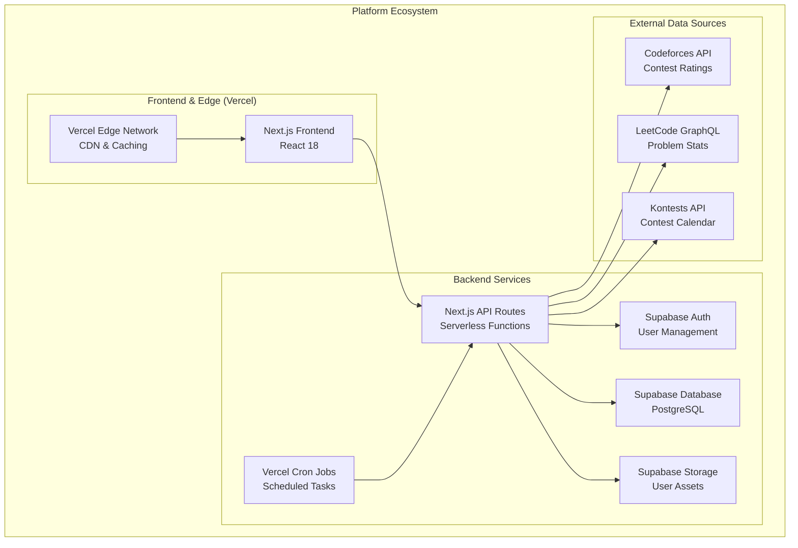
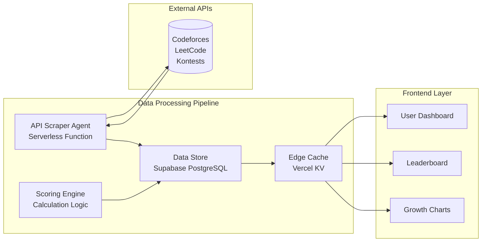
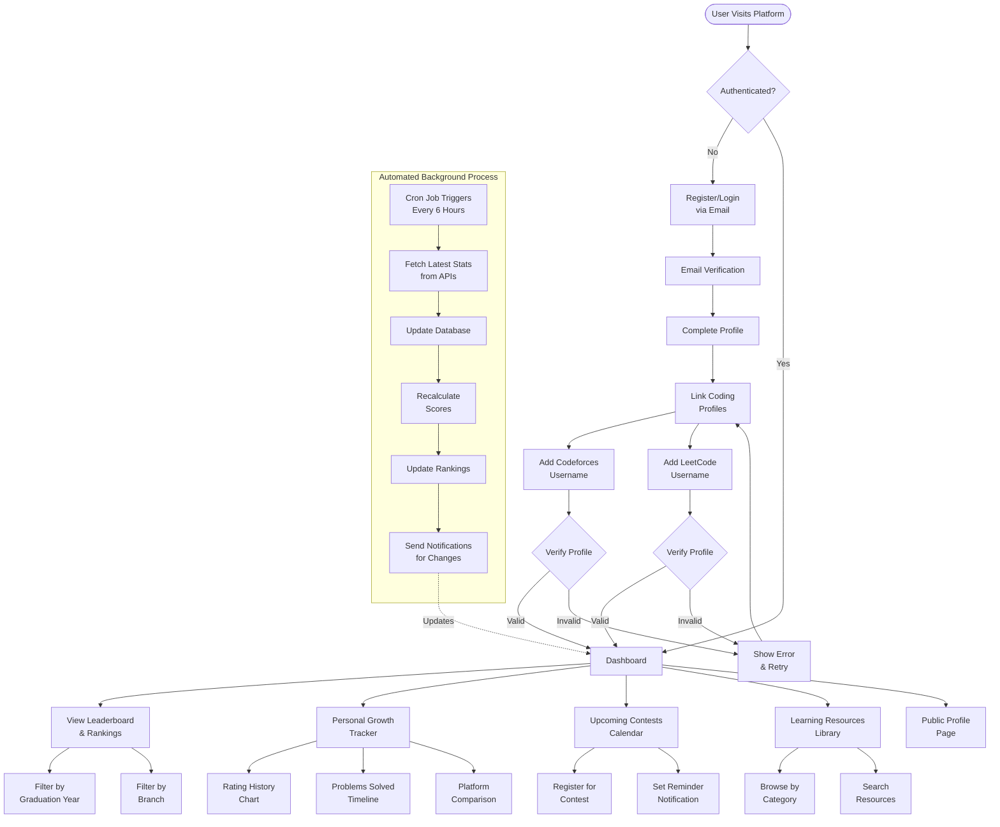
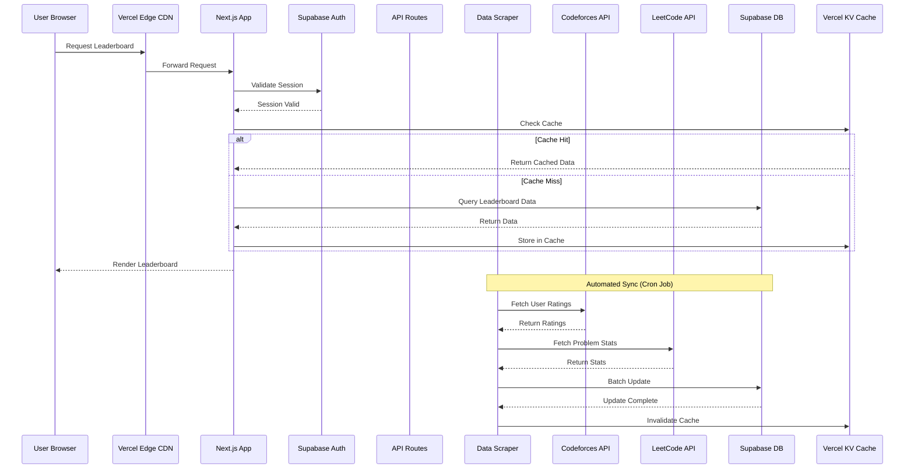

# Code IT
**"Fostering Excellence, Tracking Growth, Building Community."**

## Overview

Code IT is a centralized web platform designed exclusively for students of the KIET IT department. It consolidates, tracks, and gamifies the coding journey by integrating with major competitive programming platforms. Built on a modern, serverless technology stack using Vercel and Supabase, it provides a unified leaderboard, personal growth analytics, real-time contest feed, and curated resource hub to create a vibrant and competitive coding culture.

## Problem Statement

Students at KIET IT have their coding progress fragmented across various platforms like Codeforces and LeetCode. There's no unified way to measure or compare skills within their peer group, leading to lack of motivation and healthy competition. Students often miss important coding contests and struggle to find reliable, structured learning resources.

## Solution

A unified web application that serves as the central hub for all coding-related activities. It automatically fetches and consolidates student data from Codeforces and LeetCode into a single, dynamic leaderboard with personalized dashboards, visual growth trackers, automated contest feeds, and a curated library of learning resources.

## Architecture Overview



## Data & Scoring System Architecture



## User Journey Flow



## Request Flow Architecture



## Technology Stack

### Data Sources & APIs
- **Codeforces API**: Contest ratings, submission history, user profiles
- **LeetCode GraphQL API**: Problems solved, contest ratings, submission stats
- **Kontests API**: Aggregated upcoming contest calendar across platforms

### Frontend & Backend
- **Next.js 14**: App Router with Server Components
- **TypeScript**: Full type safety across the stack
- **Tailwind CSS**: Utility-first styling with custom design system
- **Shadcn/ui**: Accessible component library
- **React Query (TanStack Query)**: Server state management
- **Recharts**: Data visualization and charts
- **Zustand**: Client-side state management

### Cloud Infrastructure
- **Vercel**: Edge hosting, serverless functions, cron jobs
- **Vercel KV**: Redis-compatible edge caching
- **Supabase PostgreSQL**: Primary database with real-time subscriptions
- **Supabase Auth**: Authentication with email/OAuth
- **Supabase Storage**: User profile pictures and assets

### DevOps & Monitoring
- **GitHub Actions**: CI/CD pipeline
- **Vercel Analytics**: Performance and user analytics
- **Sentry**: Error tracking and monitoring
- **ESLint & Prettier**: Code quality and formatting
- **Husky**: Git hooks for pre-commit checks

## Key Features

### Core Features
- **Multi-Platform Integration**: Seamlessly connects Codeforces and LeetCode profiles
- **Dynamic Leaderboard**: Real-time ranking with custom scoring algorithm
- **Year/Branch Filters**: Compare with your cohort and department
- **Personal Dashboard**: Comprehensive overview of your coding journey
- **Growth Analytics**: Visual tracking of rating progression over time
- **Problem Statistics**: Detailed breakdown of problems solved by difficulty
- **Contest Calendar**: Never miss a contest with automated aggregation
- **Resource Library**: Curated learning materials organized by topic
- **Public Profiles**: Showcase achievements with shareable profile pages
- **Achievement System**: Badges and milestones for motivation

### Advanced Features
- **Rating Predictions**: ML-based predictions for next contest performance
- **Peer Comparison**: Compare your progress with specific friends
- **Study Groups**: Create and join collaborative learning groups
- **Contest Reminders**: Email/push notifications before contests
- **Progress Streaks**: Track daily coding consistency
- **Code Submission Insights**: Analyze submission patterns and success rates
- **Platform Recommendations**: Personalized suggestions based on skill level
- **Heatmap Calendar**: GitHub-style contribution visualization

## Getting Started

### Prerequisites

- Node.js 18+ and npm/yarn/pnpm
- Supabase account and project
- GitHub account for Vercel deployment
- Coding platform accounts (Codeforces, LeetCode) for testing

### Installation

1. Clone the repository:
```bash
git clone https://github.com/yourusername/code-it.git
cd code-it
```

2. Install dependencies:
```bash
npm install
# or
yarn install
# or
pnpm install
```

3. Set up environment variables:
```bash
cp .env.example .env.local
```

4. Configure your `.env.local` file with Supabase credentials:
```env
NEXT_PUBLIC_SUPABASE_URL=your-supabase-url
NEXT_PUBLIC_SUPABASE_ANON_KEY=your-anon-key
SUPABASE_SERVICE_ROLE_KEY=your-service-role-key
CRON_SECRET=your-secure-cron-secret
```

5. Set up the database:
```bash
# Run Supabase migrations
npx supabase db push
```

6. Run the development server:
```bash
npm run dev
# or
yarn dev
# or
pnpm dev
```

7. Open [http://localhost:3000](http://localhost:3000) in your browser.

## Environment Variables

```env
# Supabase Configuration
NEXT_PUBLIC_SUPABASE_URL=https://your-project.supabase.co
NEXT_PUBLIC_SUPABASE_ANON_KEY=your-anon-key
SUPABASE_SERVICE_ROLE_KEY=your-service-role-key

# Vercel Configuration (for production)
VERCEL_URL=your-vercel-deployment-url

# Cron Job Security
CRON_SECRET=secure-random-string-for-cron-authentication

# API Rate Limiting
RATE_LIMIT_MAX_REQUESTS=100
RATE_LIMIT_WINDOW_MS=900000

# Email Configuration (Optional)
SMTP_HOST=smtp.gmail.com
SMTP_PORT=587
SMTP_USER=your-email@gmail.com
SMTP_PASSWORD=your-app-password

# External API Keys (if required)
LEETCODE_SESSION_COOKIE=optional-for-private-data
CODEFORCES_API_KEY=optional-for-higher-limits

# Feature Flags
NEXT_PUBLIC_ENABLE_STUDY_GROUPS=true
NEXT_PUBLIC_ENABLE_PREDICTIONS=false
```

## Project Structure

```
code-it/
├── src/
│   ├── app/                           # Next.js App Router
│   │   ├── (main)/                   # Main application pages
│   │   │   ├── dashboard/           # User dashboard
│   │   │   ├── leaderboard/         # Leaderboard views
│   │   │   ├── profile/             # User profiles
│   │   │   ├── contests/            # Contest calendar
│   │   │   └── resources/           # Learning resources
│   │   ├── (auth)/                   # Authentication pages
│   │   │   ├── login/               # Login page
│   │   │   ├── register/            # Registration page
│   │   │   └── verify/              # Email verification
│   │   ├── api/                      # API Routes
│   │   │   ├── cron/                # Cron job endpoints
│   │   │   ├── users/               # User management
│   │   │   ├── platforms/           # Platform integrations
│   │   │   └── leaderboard/         # Leaderboard data
│   │   └── layout.tsx                # Root layout
│   ├── components/                    # React Components
│   │   ├── ui/                       # Base UI components
│   │   │   ├── button.tsx           # Button component
│   │   │   ├── card.tsx             # Card component
│   │   │   ├── chart.tsx            # Chart components
│   │   │   └── ...                  # Other UI components
│   │   ├── features/                 # Feature-specific components
│   │   │   ├── leaderboard/         # Leaderboard components
│   │   │   ├── profile/             # Profile components
│   │   │   ├── dashboard/           # Dashboard widgets
│   │   │   └── contests/            # Contest components
│   │   └── layout/                   # Layout components
│   │       ├── header.tsx           # Application header
│   │       ├── sidebar.tsx          # Navigation sidebar
│   │       └── footer.tsx           # Application footer
│   ├── lib/                           # Utility Libraries
│   │   ├── supabase/                 # Supabase integration
│   │   │   ├── client.ts            # Browser client
│   │   │   ├── server.ts            # Server client
│   │   │   └── middleware.ts        # Auth middleware
│   │   ├── api-clients/              # External API clients
│   │   │   ├── codeforces.ts        # Codeforces API
│   │   │   ├── leetcode.ts          # LeetCode API
│   │   │   └── kontests.ts          # Kontests API
│   │   ├── scoring/                  # Scoring system
│   │   │   ├── calculator.ts        # Score calculation
│   │   │   └── ranker.ts            # Ranking algorithm
│   │   └── utils/                    # General utilities
│   │       ├── date.ts              # Date formatting
│   │       ├── validation.ts        # Input validation
│   │       └── format.ts            # Data formatting
│   ├── hooks/                         # Custom React Hooks
│   │   ├── use-user.ts               # User data hook
│   │   ├── use-leaderboard.ts        # Leaderboard data hook
│   │   └── use-contests.ts           # Contest data hook
│   ├── stores/                        # State Management
│   │   ├── user-store.ts             # User state
│   │   └── filter-store.ts           # Filter preferences
│   └── types/                         # TypeScript Definitions
│       ├── database.ts               # Database types
│       ├── api.ts                    # API response types
│       └── user.ts                   # User types
├── public/                            # Static Assets
│   ├── images/                       # Image files
│   ├── icons/                        # Icon files
│   └── favicon.ico                   # Favicon
├── docs/                              # Documentation
│   ├── api-reference.md              # API documentation
│   ├── user-guide.md                 # User guide
│   └── deployment.md                 # Deployment guide
├── scripts/                           # Utility Scripts
│   ├── seed-data.ts                  # Database seeding
│   └── migrate.ts                    # Migration scripts
├── supabase/                          # Supabase Configuration
│   ├── migrations/                   # Database migrations
│   └── seed.sql                      # Seed data
└── tests/                             # Test Files
    ├── unit/                         # Unit tests
    └── integration/                  # Integration tests
```

## Scoring System

### Code IT Score Formula

The platform uses a weighted scoring system to create a unified ranking:

```
Code IT Score = (CF_Weight × CF_Score) + (LC_Weight × LC_Score)

Where:
- CF_Score = Codeforces Rating / 10
- LC_Score = (LeetCode_Rating × 0.5) + (Problems_Solved × 0.3)
- CF_Weight = 0.6 (60% weightage)
- LC_Weight = 0.4 (40% weightage)
```

### Score Components

**Codeforces Contribution (60%)**
- Current rating divided by 10
- Example: 1500 rating = 150 points

**LeetCode Contribution (40%)**
- Contest rating: 50% weight
- Problems solved: 30% weight (with difficulty multipliers)
- Example: 2000 rating + 500 problems = (1000 × 0.5) + (150 × 0.3) = 545 points

### Ranking Tiers

- **Grandmaster**: 800+ points
- **Master**: 600-799 points
- **Expert**: 400-599 points
- **Specialist**: 200-399 points
- **Pupil**: 0-199 points

## Data Scraper System

### Automated Sync Process

The data scraper runs every 6 hours via Vercel Cron Jobs:

```typescript
// src/app/api/cron/sync/route.ts
export async function GET(request: Request) {
  // Verify cron secret
  const authHeader = request.headers.get('authorization');
  if (authHeader !== `Bearer ${process.env.CRON_SECRET}`) {
    return new Response('Unauthorized', { status: 401 });
  }

  // Fetch all active users
  const users = await supabase
    .from('users')
    .select('*')
    .eq('is_active', true);

  // Process each user
  for (const user of users.data) {
    await syncUserData(user);
  }

  return Response.json({ success: true });
}
```

### Sync Workflow

1. **Fetch User List**: Query all active users from database
2. **API Calls**: Make parallel requests to Codeforces and LeetCode
3. **Data Validation**: Verify data integrity and handle errors
4. **Score Calculation**: Compute new scores using formula
5. **Database Update**: Batch update user records
6. **Rank Recalculation**: Update leaderboard rankings
7. **Cache Invalidation**: Clear cached leaderboard data
8. **Notifications**: Send updates for significant rank changes

## Development Workflow

### Local Development

1. Start Supabase locally (optional):
```bash
npx supabase start
```

2. Run the development server:
```bash
npm run dev
```

3. Access the application at `http://localhost:3000`

4. Make changes to components or pages - hot reload will update automatically

### Code Quality

```bash
# Run type checking
npm run type-check

# Run linting
npm run lint

# Fix linting issues
npm run lint:fix

# Format code
npm run format

# Run all checks
npm run validate
```

### Testing

```bash
# Run unit tests
npm run test

# Run tests in watch mode
npm run test:watch

# Run tests with coverage
npm run test:coverage

# Run integration tests
npm run test:integration

# Run E2E tests
npm run test:e2e
```

### Database Management

```bash
# Create a new migration
npx supabase migration new migration_name

# Apply migrations
npx supabase db push

# Reset database (destructive)
npx supabase db reset

# Generate TypeScript types
npx supabase gen types typescript --local > src/types/database.ts
```

## Deployment

### Vercel Deployment

1. Connect your GitHub repository to Vercel
2. Configure environment variables in Vercel dashboard
3. Deploy:

```bash
# Manual deployment
vercel deploy

# Production deployment
vercel --prod
```

### Supabase Setup

1. Create a new Supabase project
2. Run migrations:
```bash
npx supabase db push
```

3. Configure authentication providers
4. Set up Row Level Security (RLS) policies

### Cron Job Configuration

In `vercel.json`:

```json
{
  "crons": [
    {
      "path": "/api/cron/sync",
      "schedule": "0 */6 * * *"
    },
    {
      "path": "/api/cron/contests",
      "schedule": "0 0 * * *"
    }
  ]
}
```

## API Documentation

### Authentication Endpoints

- `POST /api/auth/register` - Register new user
- `POST /api/auth/login` - User login
- `POST /api/auth/logout` - User logout
- `POST /api/auth/verify` - Verify email
- `POST /api/auth/reset-password` - Password reset

### User Management Endpoints

- `GET /api/users/profile` - Get user profile
- `PUT /api/users/profile` - Update user profile
- `POST /api/users/link-platform` - Link coding platform
- `DELETE /api/users/unlink-platform` - Unlink coding platform
- `GET /api/users/:id` - Get public user profile

### Leaderboard Endpoints

- `GET /api/leaderboard` - Get leaderboard data
  - Query params: `year`, `branch`, `page`, `limit`
- `GET /api/leaderboard/stats` - Get overall statistics
- `GET /api/leaderboard/:userId/rank` - Get user's rank

### Platform Data Endpoints

- `GET /api/platforms/codeforces/:username` - Get Codeforces data
- `GET /api/platforms/leetcode/:username` - Get LeetCode data
- `POST /api/platforms/sync/:userId` - Manually trigger sync

### Contest Endpoints

- `GET /api/contests` - Get upcoming contests
- `GET /api/contests/platform/:platform` - Filter by platform
- `POST /api/contests/reminder` - Set contest reminder

### Resource Endpoints

- `GET /api/resources` - Get all resources
- `GET /api/resources/:category` - Get resources by category
- `POST /api/resources` - Add new resource (admin only)
- `PUT /api/resources/:id` - Update resource (admin only)
- `DELETE /api/resources/:id` - Delete resource (admin only)

## Contributing

We welcome contributions from KIET IT students!

### Contribution Guidelines

1. Fork the repository
2. Create a feature branch: `git checkout -b feature/amazing-feature`
3. Make your changes and commit: `git commit -m 'Add amazing feature'`
4. Push to the branch: `git push origin feature/amazing-feature`
5. Open a Pull Request

### Code Standards

- Follow TypeScript best practices
- Write meaningful commit messages
- Add tests for new features
- Update documentation as needed
- Ensure all tests pass before submitting PR

### Feature Requests

Open an issue with the tag `enhancement` to propose new features.

## Cost Analysis

### Vercel Costs (Hobby → Pro Plan)

**Hobby Plan (Free)**
- 100 GB bandwidth/month
- 100 GB-hours serverless function execution
- 1000 cron job executions/month

**Pro Plan ($20/month) - Recommended for production**
- 1 TB bandwidth
- 1000 GB-hours function execution
- Unlimited cron jobs
- Team collaboration

### Supabase Costs

**Free Tier**
- 500 MB database storage
- 1 GB file storage
- 50,000 monthly active users
- 2 GB bandwidth

**Pro Plan ($25/month) - Recommended for 200+ users**
- 8 GB database storage
- 100 GB file storage
- 100,000 monthly active users
- 50 GB bandwidth

### Estimated Monthly Costs

**Tier 1 (0-100 users)**
- Vercel: Free
- Supabase: Free
- **Total: $0/month**

**Tier 2 (100-500 users)**
- Vercel: $20
- Supabase: $25
- **Total: $45/month (~₹3,750)**

**Tier 3 (500+ users)**
- Vercel Pro: $20
- Supabase Pro: $25
- Additional bandwidth: ~$10
- **Total: $55/month (~₹4,600)**

## Security & Privacy

### Data Protection

- **Encryption**: All data encrypted in transit (TLS) and at rest
- **Authentication**: Secure session management with Supabase Auth
- **RLS Policies**: Row-level security for data access control
- **API Security**: Rate limiting and authentication on all endpoints
- **Input Validation**: Comprehensive validation of all user inputs

### Privacy Measures

- **Public Data Only**: Only publicly available platform data is scraped
- **User Consent**: Users explicitly link their coding profiles
- **Data Minimization**: Only necessary data is stored
- **Right to Delete**: Users can delete their accounts and data
- **Transparent Policies**: Clear privacy policy and terms of service

### Security Best Practices

```typescript
// Example: Secure API route with authentication
import { createRouteHandlerClient } from '@supabase/auth-helpers-nextjs';

export async function GET(request: Request) {
  const supabase = createRouteHandlerClient({ cookies });
  
  // Verify authentication
  const { data: { session } } = await supabase.auth.getSession();
  if (!session) {
    return new Response('Unauthorized', { status: 401 });
  }
  
  // Proceed with authenticated logic
}
```

## Monitoring & Analytics

### Performance Monitoring

- **Vercel Analytics**: Page load times, Core Web Vitals
- **Error Tracking**: Sentry for runtime error monitoring
- **API Monitoring**: Response times and success rates
- **Database Performance**: Query optimization and indexing

### User Analytics

- **Engagement Metrics**: Active users, session duration
- **Feature Usage**: Most used features and pages
- **Growth Tracking**: User acquisition and retention
- **Platform Insights**: Popular coding platforms and contests

## Support & Documentation

- **User Guide**: [docs/user-guide.md](docs/user-guide.md)
- **Developer Guide**: [docs/developer-guide.md](docs/developer-guide.md)
- **API Reference**: [docs/api-reference.md](docs/api-reference.md)
- **Troubleshooting**: [docs/troubleshooting.md](docs/troubleshooting.md)
- **Discord Community**: [Join our server](https://discord.gg/kiet-it)

## Roadmap

### Phase 1 (Current) - MVP
- ✅ User authentication and profiles
- ✅ Platform integration (Codeforces, LeetCode)
- ✅ Dynamic leaderboard
- ✅ Contest calendar
- ✅ Basic resource library

### Phase 2 (Q2 2025)
- 🔄 Mobile application (React Native)
- 🔄 Advanced analytics dashboard
- 🔄 Study groups feature
- 🔄 Achievement system
- 🔄 Code submission insights

### Phase 3 (Q3 2025)
- 📋 ML-based performance predictions
- 📋 Personalized learning paths
- 📋 Peer-to-peer mentoring system
- 📋 Integration with more platforms (CodeChef, AtCoder)
- 📋 Virtual coding competitions

### Phase 4 (Q4 2025)
- 📋 AI-powered problem recommendations
- 📋 Interview preparation module
- 📋 Company-specific practice sets
- 📋 Career guidance and placement prep
- 📋 Alumni network integration

## FAQ

**Q: How often is the data updated?**
A: The platform syncs data every 6 hours automatically. You can also manually refresh your profile.

**Q: Why isn't my LeetCode data showing?**
A: Ensure your LeetCode profile is public. Private profiles cannot be accessed by the API.

**Q: How is the Code IT Score calculated?**
A: It's a weighted combination of Codeforces rating (60%) and LeetCode stats (40%). See the Scoring System section for details.

**Q: Can I remove my profile from the leaderboard?**
A: Yes, you can deactivate your account in settings. Your data will be hidden from public view.

**Q: How do I report a bug?**
A: Open an issue on GitHub with the `bug` tag, or contact us via the support email.

## License

This project is licensed under the MIT License - see the [LICENSE](LICENSE) file for details.

## Acknowledgments

- Developed by KIET IT students for KIET IT students
- Built with modern web technologies
- Inspired by the need for a unified coding community
- Special thanks to all contributors and beta testers

---

**Code IT** - Empowering KIET IT students to excel in competitive programming together 🚀

**Made with ❤️ by the KIET IT Community**
